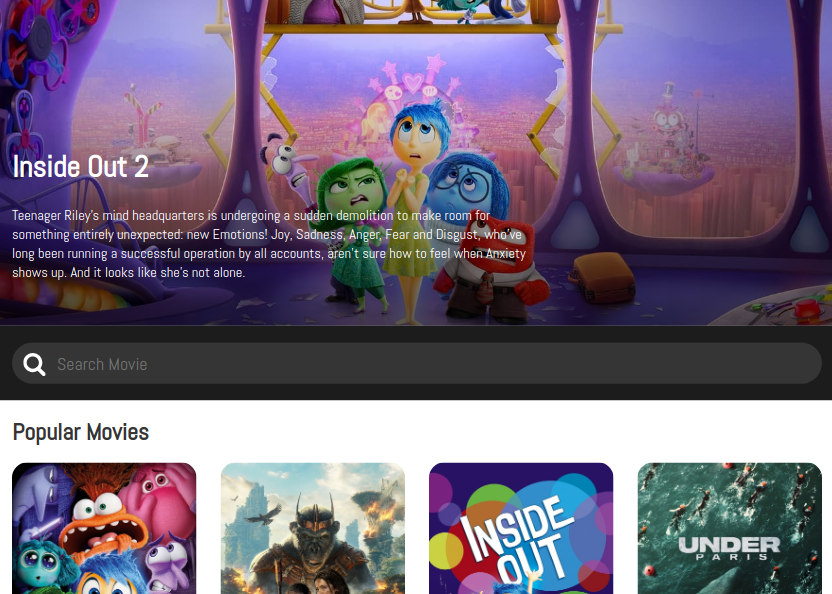

## **Draft Projects 1**

This repo contains follow along projects done for the purpose of learning.

**Promptopia** | Next.js • Tailwind • MongoDB • OAuth
- Sign in with your google account, Add/Edit/Delete Posts and view other user's posts on the same database.
- [ Tutorial's link](https://www.youtube.com/watch?v=wm5gMKuwSYk&t=3348s)

**React-Movie-App** | React.js • Styled-Components • TMDB API

- Displaying the latest movies in theaters with their description and thumbnails with -the help of the The Movie Database (TMDB) API.
- The project emphasizes on the use of separate small components to be combined on a one major component.
- The component styling was made through the "styled-components" third party library which allows for each component to have a file describing its css styling.
- [ Tutorial's link](https://www.youtube.com/watch?v=6bxWgYfN4CQ)